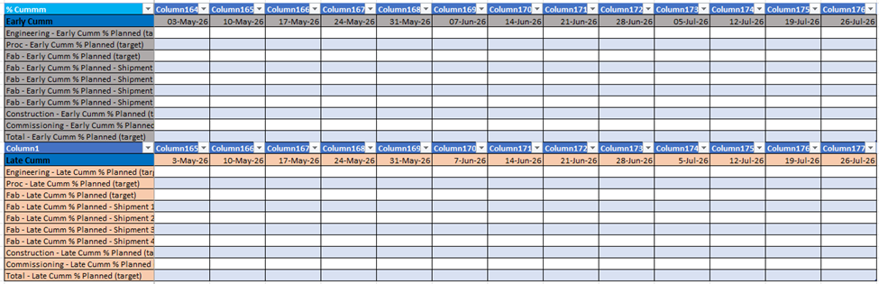
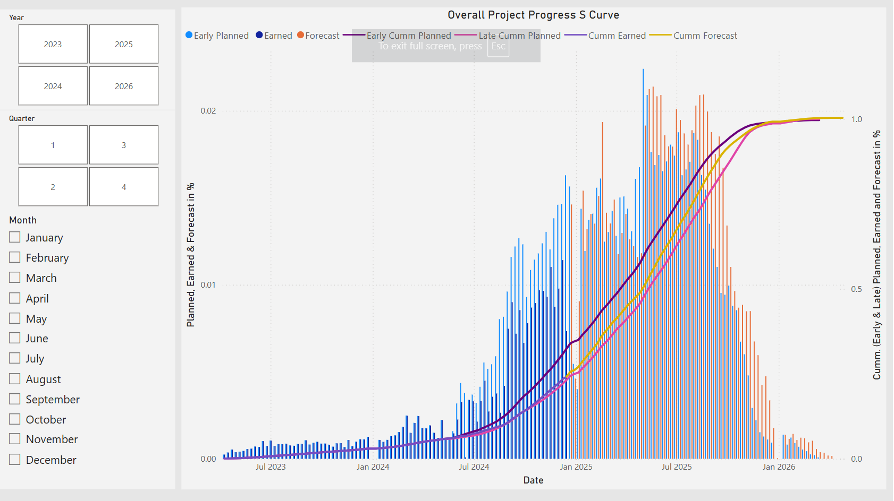
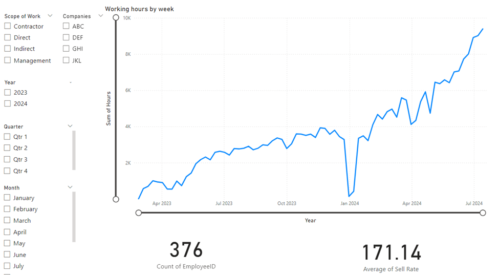

    <iframe title="Dashboard 1"
            src="https://app.powerbi.com/view?r=eyJrIjoiZDQxMTc1NDItZjU4OC00ODAxLWFhMTUtZTUwZTA1Mjk5NThkIiwidCI6ImRmODY3OWNkLWE4MGUtNDVkOC05OWFjLWM4M2VkN2ZmOTVhMCJ9"
            frameborder="0"
            allowFullScreen="true"
            style="width: 100%; height: 75vh; border: none;">
    </iframe>

    <iframe title="Dashboard 2"
            src="https://app.powerbi.com/view?r=eyJrIjoiOGZlZGU0NjgtMWYzOC00NDJkLTg3MDYtZWYwMmNlNTRjZDc3IiwidCI6ImRmODY3OWNkLWE4MGUtNDVkOC05OWFjLWM4M2VkN2ZmOTVhMCJ9"
            frameborder="0"
            allowFullScreen="true"
            style="width: 100%; height: 75vh; border: none;">
    </iframe>

# Power BI Dashboards for Project Performance and Work Hours Analysis

## PROJECT DESCRIPTION:

The client sought a solution to effectively track project performance and manage working hours, specifically focusing on monitoring estimated versus actual hours with dynamic filtering for detailed analysis. The project data, managed in Primavera and Excel, was provided in a wide-format Excel workbook. My role was to design and implement interactive Power BI dashboards that could showcase performance scenarios and be easily updated weekly with revised data.

## STEP BY STEP PROCESS:

To prepare the wide-format data for Power BI, two approaches were explored:

### Unpivoting Data: 
The wide-format data was to be converted into a long-format structure using Power Query, with each row representing a date, task/phase, and its value. This transformation could enable the creation of dynamic visualizations like line charts for tracking progress and matrix tables for comparing planned versus actual metrics. Filters, slicers, and calculated measures were to be added for detailed performance analysis.

### Transposing Data: 
Another method involved dividing the Excel data into smaller logical tables by tasks or phases, transposing the data to have dates in rows and values in columns, and cleaning it for consistency. These tables were linked using the dates column as a primary key, enabling seamless analysis. [I opted this approach]

To optimize the model further, I implemented a normalization approach by dividing the main data table (containing 376 employees) into three smaller tables to eliminate repeating values. Repeating fields such as area codes, company names, job titles, employee details, and work descriptions were moved into a separate table, reducing redundancy and improving performance. A unique date table was also created and linked to other tables to ensure consistency.

Two dashboards were developed to meet the client’s requirements:

### Line and Clustered Column Chart Dashboard: 
This dashboard showcased the project’s overall S-curve. The x-axis represented dates, while the clustered column y-axis displayed variables such as "Early Period % Planned (Target)," "Period % Earned," and "Period % Forecast." The line y-axis included "Early Cumulative % Planned (Target)," "Late Cumulative % Planned (Target)," "Cumulative % Earned," and "Cumulative % Forecast." A date slicer allowed users to filter data dynamically.

### Work Hours and Employee Analysis Dashboard: 
This dashboard included a line chart showing dates on the x-axis and the sum of hours on the y-axis. Additional cards displayed the number of employees in a category and their average sell rate. Three slicers were included for enhanced interactivity: one for company (four companies in total), one for the scope of work, and one for dates (with year, quarter, and month filters). 

These user-friendly dashboards enabled the client to monitor project performance, analyze working hours, and explore various scenarios efficiently, while providing an optimized and scalable solution for weekly updates.

## FEATURES AND SKILLS DEMONSTRATED IN THE PROJECT:

### A. Data Transformation and Preparation:

Converted wide-format data into long-format using Power Query's Unpivot Columns feature for better compatibility with Power BI.

Transposed data to rearrange rows and columns, ensuring dates were in rows and values in columns for analysis.\

Cleaned and optimized data by removing duplicates, inconsistencies, and unnecessary fields.

Normalized the dataset by splitting the main table into smaller tables, extracting unique values for fields like employee details, work descriptions, and dates to improve performance and scalability.

### B. Data Modeling and Relationships:

Created logical relationships between tables using the dates column as a primary key to enable seamless integration across datasets.

Designed an efficient data model by linking smaller tables (e.g., employee details, task categories, and dates) for better performance and easier management.

### C. Power BI Dashboard Development:

Designed interactive dashboards tailored to the client’s requirements with user-friendly features and real-time insights.

Implemented a Line and Clustered Column Chart for visualizing the project’s S-curve, showcasing planned, earned, and forecast metrics dynamically.

Developed a line chart to display working hours over time, complemented by cards for displaying KPIs like the number of employees and their average sell rate.

### D. Dynamic Filtering and Slicers:

Incorporated slicers for filtering data by company, scope of work, and dates, enabling users to analyze performance across various scenarios (e.g., year, quarter, or month).

Added interactive features to allow users to drill down into detailed project metrics.

### E. Technical Optimization:

Reduced redundancy and improved performance by normalizing the data and creating unique value tables for fields with repeating entries.

Ensured dashboards could be updated weekly with minimal effort by structuring the data model for easy integration of new Excel data.

### F. Visualization and Analysis:

Created visually appealing and intuitive dashboards that effectively communicated project performance metrics and working hour trends.

Used calculated measures and metrics to track and compare cumulative planned, earned, and forecast percentages dynamically.

## SKILLS HIGHLIGHTED:
 
### 1. Power BI Expertise: 
Dashboard creation, data visualization, Power Query, and advanced filtering.

### 2. Data Modeling: 
Normalization, relationship building, and optimization.

### 3. Data Transformation: 
Unpivoting, transposing, and cleaning data for analysis.

### 4. Project Management Analysis: 
Ability to track and compare project metrics like planned vs. actual working hours.

### 5. Problem Solving: 
Devised multiple solutions to handle wide-format data and optimize performance for large datasets.

### 6. Communication: 
Designed dashboards with clear, actionable insights tailored to the client’s needs.