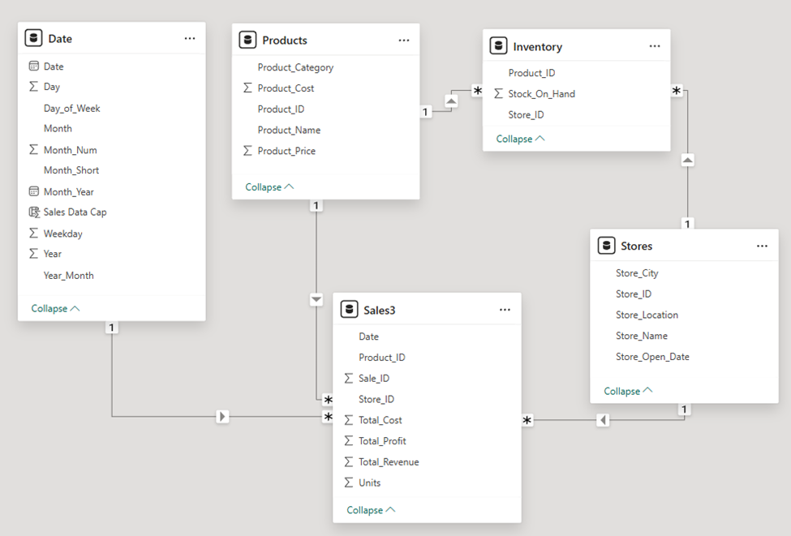
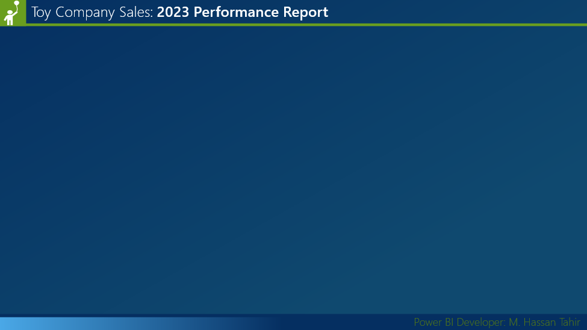
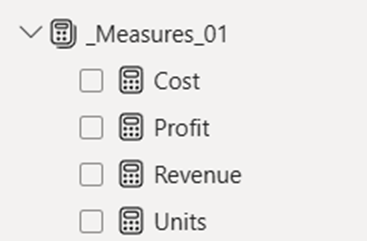
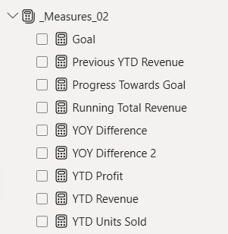
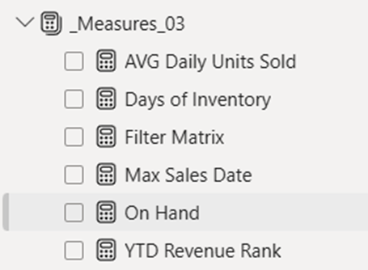
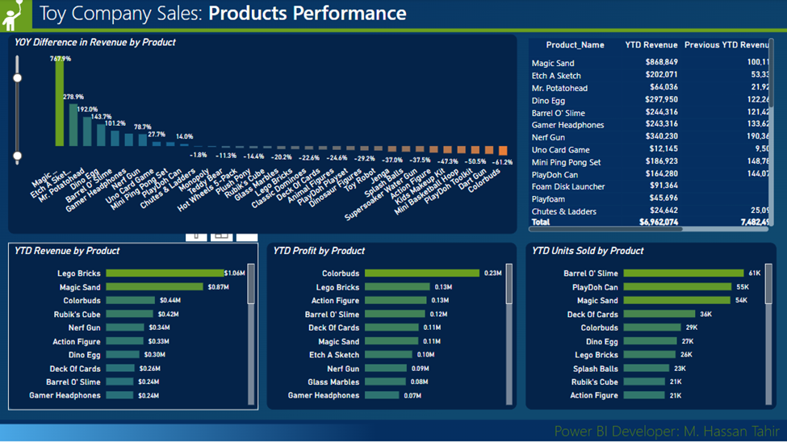
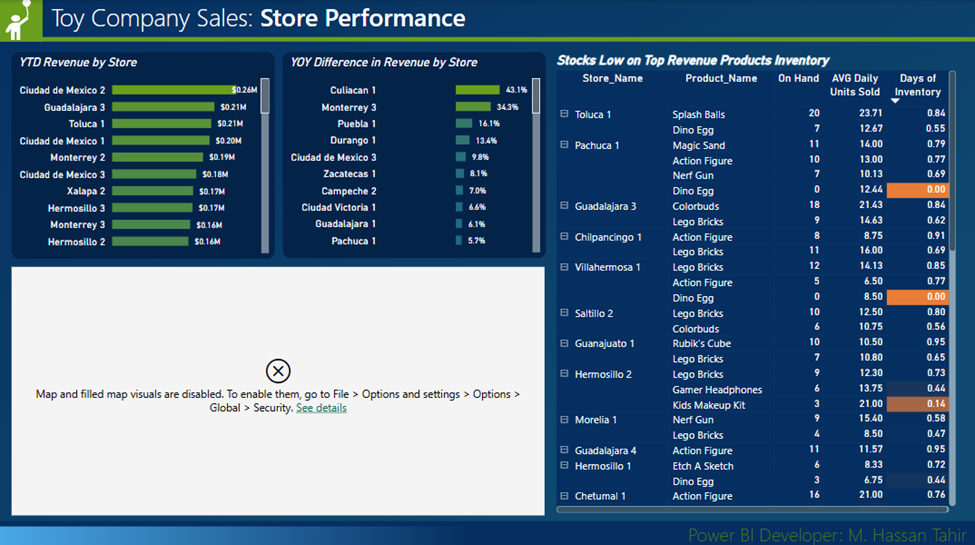

# Designing a Data-Driven Power BI Dashboard

## for Sales, Product, and Store Insights -

## From Data Preparation to Interactive Visualizations

---

## Table of Contents

- [Designing a Data-Driven Power BI Dashboard](#designing-a-data-driven-power-bi-dashboard)
  - [for Sales, Product, and Store Insights -](#for-sales-product-and-store-insights--)
  - [From Data Preparation to Interactive Visualizations](#from-data-preparation-to-interactive-visualizations)
  - [Table of Contents](#table-of-contents)
  - [1. Introduction](#1-introduction)
    - [1.1 Objective of the Report](#11-objective-of-the-report)
    - [1.2 Overview of the Dashboard and Key Components](#12-overview-of-the-dashboard-and-key-components)
  - [2. Data Preparation and Importing](#2-data-preparation-and-importing)
    - [2.1 Checking the Data](#21-checking-the-data)
    - [2.2 Importing Data into Power BI](#22-importing-data-into-power-bi)
    - [2.3 Extract, Transform, Load (ETL) Process](#23-extract-transform-load-etl-process)
    - [2.4 Relationship Setup and Data Integrity Check](#24-relationship-setup-and-data-integrity-check)
    - [2.5 Saving and Closing Power Query Editor](#25-saving-and-closing-power-query-editor)
  - 
  - [3. Dashboard Design: Layout and Aesthetics](#3-dashboard-design-layout-and-aesthetics)
    - [3.1 PowerPoint Layout Creation](#31-powerpoint-layout-creation)
    - [3.2 Color Palette Selection](#32-color-palette-selection)
    - [3.3 Importing Layout into Power BI](#33-importing-layout-into-power-bi)
  - 
  - [4. Measure Creation and Data Calculations](#4-measure-creation-and-data-calculations)
    - [4.1 Basic Measures](#41-basic-measures)
    - [4.2 Advanced Measures](#42-advanced-measures)
    - [4.3 Custom Columns and Calculations](#43-custom-columns-and-calculations)
  - [5. Data Visualizations](#5-data-visualizations)
    - [5.1 First Page: Sales Performance](#51-first-page-sales-performance)
    - [5.2 Second Page: Product Performance](#52-second-page-product-performance)
    - [5.3 Third Page: Store Performance](#53-third-page-store-performance)
    - [5.4 Fourth Page: Tooltip Page](#54-fourth-page-tooltip-page)
  - [6. Page and Visualization Formatting](#6-page-and-visualization-formatting)
    - [6.1 Formatting Visuals](#61-formatting-visuals)
    - [6.2 Customizing Titles and Labels](#62-customizing-titles-and-labels)
    - [6.3 Responsive Design and Interactivity](#63-responsive-design-and-interactivity)
  - [7. Final Review and Conclusion](#7-final-review-and-conclusion)
    - [7.1 Reviewing Data Accuracy and Visual Appeal](#71-reviewing-data-accuracy-and-visual-appeal)
    - [7.2 Conclusion and Next Steps](#72-conclusion-and-next-steps)
  - [8. Features of the Project](#8-features-of-the-project)
    - [8.1 Layout and Design](#81-layout-and-design)
    - [8.2 Data Import and Transformation (ETL)](#82-data-import-and-transformation-etl)
    - [8.3 DAX Measures and Calculations](#83-dax-measures-and-calculations)
    - [8.4 Visualizations](#84-visualizations)
    - [8.5 Conditional Formatting](#85-conditional-formatting)
    - [8.6 Custom Themes and Layouts](#86-custom-themes-and-layouts)
    - [8.7 Tooltips](#87-tooltips)
    - [8.8 Dashboard Interactivity](#88-dashboard-interactivity)
  - [9. Skills](#9-skills)

---

## 1. Introduction

### 1.1 Objective of the Report
This report outlines the process of creating a Power BI report / dashboard to analyze business performance across various dimensions, such as sales, products, and stores. The goal is to transform raw business data into insightful visualizations that aid decision-making. The report will guide you through each step of the process, from data preparation to the final formatting of the dashboard. Specifically, it covers:

- Data preparation and cleaning
- Layout design for the dashboard
- Creation of measures and calculated columns
- Development of data visualizations
- Formatting and styling to enhance readability and usability

By the end of this process, you will have a fully functional Power BI dashboard with interactive elements that allow users to analyze trends and patterns in sales, products, and store performance.

### 1.2 Overview of the Dashboard and Key Components
The dashboard consists of four pages, each focusing on a distinct area of business performance:

- **Sales Performance**: Provides a high-level overview of sales metrics, trends, and comparisons.
- **Product Performance**: Analyzes how individual products are performing in terms of sales, revenue, and profitability.
- **Store Performance**: Visualizes the performance of stores, highlighting key metrics like revenue, YoY differences, and inventory.
- **Tooltip Page**: Displays additional contextual information, such as top products and metrics, that can be used interactively across the dashboard.

---

## 2. Data Preparation and Importing

This chapter focuses on preparing and importing the necessary data into Power BI, ensuring it is clean and ready for analysis. You will learn how to inspect data, perform data transformations, and set up relationships between tables.

### 2.1 Checking the Data
The first step is to understand the available data. There are five main tables: Dates, Sales, Store, Product, and Inventory. You need to familiarize yourself with these tables to determine how they can be used together.

### 2.2 Importing Data into Power BI
Open Power BI and import the necessary data files. Power BI offers several ways to load data, but we will focus on importing from a folder, which allows for flexibility in handling multiple files.

### 2.3 Extract, Transform, Load (ETL) Process

- **2.3.1 Importing Data and Query Modifications**: Import the data files into Power BI, ensuring that data from different sources is consolidated. Disable the load for the source queries that are not required.
- **2.3.2 Data Transformation and Merging**: Create references for each table in Power Query Editor. Merge necessary columns, such as product cost and price, into the Sales table. Filter the Dates table to only include data from 2021 onward.
- **2.3.3 Filtering and Merging Columns**: Filter data based on specific criteria, and ensure that only relevant columns are loaded for analysis. New calculated columns like total revenue and cost can be added here.

### 2.4 Relationship Setup and Data Integrity Check
Ensure all tables are properly related. For instance, connect the Dates table to the Sales table to allow date-based filtering. Verify that these relationships are accurate, as they will affect how data is visualized.

### 2.5 Saving and Closing Power Query Editor
After completing all necessary transformations, save your work and close the Power Query Editor to return to the main Power BI interface.

---

## 3. Dashboard Design: Layout and Aesthetics

This chapter focuses on designing the layout and visual style of the dashboard. The aim is to create a user-friendly interface that aligns with the company's branding while ensuring that data visualizations are clear and effective.

### 3.1 PowerPoint Layout Creation
Begin by designing a rough layout for the dashboard in PowerPoint. This will allow you to visualize where each element will be placed before implementing it in Power BI.

- **3.1.1 Theme Selection and Background Customization**: Choose a design theme that reflects your company's brand. Customize the background with the company's colors to ensure the dashboard fits the corporate identity.
- **3.1.2 Header and Footer Design**: Add a header with the company logo and a footer with any necessary credits or disclaimers.

### 3.2 Color Palette Selection
Select a color palette that complements the overall design. Ensure that colors are accessible and visually pleasing to the user. Import this palette into Power BI.

### 3.3 Importing Layout into Power BI
Save the PowerPoint layout as an SVG file and import it into Power BI. Adjust the transparency settings to align the imported layout with the data visualizations.

---

## 4. Measure Creation and Data Calculations

This chapter outlines how to create the key metrics that will drive the analysis. You will learn how to create both simple and advanced measures to capture business performance.

### 4.1 Basic Measures
The basic measures are essential for calculating key metrics like total revenue and profit.

- **4.1.1 Revenue, Cost, Units, and Profit**: These measures are created by summing the relevant columns from the Sales table. For example, revenue is calculated as SUM(Sales[Total Revenue]), while cost is SUM(Sales[Cost]). Profit is calculated as SUM(Sales[Profit]).

### 4.2 Advanced Measures
These measures provide more detailed insights by using DAX functions.

- **4.2.1 YTD Revenue and Previous YTD Revenue**: The Year-to-Date (YTD) Revenue measure calculates cumulative revenue up to the current date using the TOTALYTD function. The Previous YTD Revenue measure is calculated using a combination of SAMEPERIODLASTYEAR and TOTALYTD.
- **4.2.2 YoY Difference and Running Total Revenue**: The Year-over-Year (YoY) Difference compares this year's performance to last year's by subtracting the previous YTD revenue from the current YTD. The Running Total Revenue is calculated using the CALCULATE function with the FILTER argument to accumulate revenue over time.
- **4.2.3 Goal Setting and Progress Towards Goal**: To set a goal, define a target revenue value and calculate the progress by comparing actual revenue to the goal. The measure might look like Progress Towards Goal = SUM(Sales[Revenue]) / Goal.

### 4.3 Custom Columns and Calculations
New calculated columns like Profit Margin or Revenue Per Unit can be added to the Sales table to provide deeper insights. For example, the profit margin is calculated as Profit Margin = SUM(Sales[Profit]) / SUM(Sales[Revenue]).

---

## 5. Data Visualizations

This chapter will guide you through the process of creating dynamic and insightful data visualizations that will form the heart of the dashboard. Each page of the dashboard will contain specific visualizations that cater to different aspects of business performance.

### 5.1 First Page: Sales Performance
This page provides a high-level overview of sales metrics.

- **5.1.1 Visuals: Line Chart, Bar Chart, and Cards**: Use a line chart to display revenue trends, a bar chart to compare YoY differences, and cards to highlight key metrics such as total revenue and profit.
- **5.1.2 Formatting and Visual Enhancements**: Apply consistent formatting to improve readability, such as adjusting font sizes, colors, and axis labels.

### 5.2 Second Page: Product Performance
This page drills down into the performance of individual products.

- **5.2.1 Visuals: Horizontal Bar Charts, Matrix**: Create bar charts to show product-level performance (e.g., revenue, profit, units sold) and a matrix to compare multiple metrics across products.
- **5.2.2 Formatting and Visual Enhancements**: Ensure the page layout is clean and visually appealing by organizing the visualizations effectively.

### 5.3 Third Page: Store Performance
This page visualizes store-level performance across various metrics.

- **5.3.1 Visuals: Horizontal Bar Charts, Matrix, and Map**: Display store performance with bar charts for revenue, a matrix for inventory, and a map to geographically show performance.
- **5.3.2 Formatting and Visual Enhancements**: Use consistent formatting and colors that match the overall theme.

### 5.4 Fourth Page: Tooltip Page
This page is designed to show additional information when hovering over other visuals.

- **5.4.1 Visuals: Cards and Charts**: Include cards for key metrics and charts showing the top-performing products.
- **5.4.2 Formatting and Setting up Tooltip**: Ensure that the tooltip displays correctly by adjusting its transparency and setting it up as a tooltip page in Power BI.

---

## 6. Page and Visualization Formatting

The goal of this chapter is to ensure the dashboard's aesthetics are polished and consistent across all pages.

### 6.1 Formatting Visuals
Apply uniform formatting to all visual elements to maintain a clean and cohesive look.

- **6.1.1 Font, Color, and Styling**: Standardize font types, sizes, and colors to ensure readability and visual hierarchy.
- **6.1.2 Visual Border and Effects**: Add borders, shadows, and other effects to make the visual elements stand out.

### 6.2 Customizing Titles and Labels
Adjust titles and labels for clarity, ensuring they are descriptive and easy to understand.

### 6.3 Responsive Design and Interactivity
Make sure that interactive elements like slicers and filters work smoothly, and the dashboard is responsive across different devices.

---

## 7. Final Review and Conclusion

This chapter reviews the dashboard as a whole, ensuring it meets business requirements, and outlines next steps for improvement or deployment.

### 7.1 Reviewing Data Accuracy and Visual Appeal
Conduct a final check to ensure all data is accurate and all visualizations are clear and aligned with business goals.

### 7.2 Conclusion and Next Steps
Summarize the results and suggest further steps, such as sharing the dashboard with stakeholders, conducting user testing, or adding new features based on feedback.

---

## 8. Features of the Project

This chapter summarizes the features of Power BI that were used in this project.

### 8.1 Layout and Design
- **8.1.1 Themes and Color Palette**: A custom color palette is designed in Power BI, with a balance of cool and warm colors, that were predefined in PowerPoint for visual consistency.
- **8.1.2 Aesthetic Principles**: Concepts from Gestalt psychology such as contrast, proximity, and symmetry are used to ensure the layout is visually appealing and intuitive.
- **Background Design**: Custom backgrounds are designed in PowerPoint and saved as SVG files for import into Power BI. This ensures high-quality resolution when scaling the design in Power BI.

### 8.2 Data Import and Transformation (ETL)
- **8.2.1 Power Query Editor**: Used to import and transform data from multiple tables (Sales, Store, Product, Inventory, Dates). It allows for filtering, merging tables, and creating new calculated columns like Total Revenue, Total Cost, and Profit.
- **8.2.2 Data Model Creation**: Relationships between different tables are established, connecting the Dates table with Sales to ensure accurate data analysis and reporting.

### 8.3 DAX Measures and Calculations
- **8.3.1 Basic Measures**: Calculations like Total Revenue, Cost, Units Sold, and Profit are created using DAX (Data Analysis Expressions).
- **8.3.2 Advanced Measures**: Complex calculations are created using DAX functions such as **TOTALYTD** (Year-to-Date), **YTD Revenue** and **Previous YTD Revenue**, **YoY Difference**, **Running Total Revenue**, and **Progress Towards Goal**.
- **8.3.3 Custom Measures**: Measures like **Days of Inventory**, **On Hand Stock**, and **YTD Profit** are calculated based on inventory and sales data.

### 8.4 Visualizations
- **8.4.1 Line Charts**: Used to display trends in revenue over time, with specific focus on YoY (Year over Year) revenue comparison and YTD (Year-to-Date) progress.
- **8.4.2 Bar Charts**: Visualize comparisons such as YoY difference by product category and store location, as well as YTD Revenue by product.
- **8.4.3 Cards**: Simple visual elements that display key metrics such as Revenue, Profit, Goal, and Progress towards the goal.
- **8.4.4 Matrix Visualization**: Helps display tabular data with various metrics such as YTD Revenue, YTD Profit, and YoY difference.
- **8.4.5 Maps**: Geographic representation of revenue data, with conditional formatting for bubbles based on revenue, helping to visualize performance by store location.

### 8.5 Conditional Formatting
Custom color schemes and formatting are applied to charts, cards, and tables to improve readability and emphasize key metrics.

### 8.6 Custom Themes and Layouts
Custom themes are imported, with specific color palettes created in PowerPoint, to maintain consistency across visualizations. Page backgrounds and canvas transparency settings are adjusted to align with the aesthetic design of the dashboard.

### 8.7 Tooltips
Tooltips are customized to display additional information when hovering over visuals, providing further details about specific data points.

### 8.8 Dashboard Interactivity
- **8.8.1 Filters and Slicers**: Users can interact with the dashboard to view data filtered by specific time frames, product categories, or store locations.
- **8.8.2 Dynamic Measures**: The data updates dynamically based on the filters and slicers applied by the user.

---

## 9. Skills

Here are some core skills from the project, along with brief explanations:

- **9.1 Data Import and ETL (Extract, Transform, Load)**: Proficient in using Power BI's Power Query Editor to import, transform, and clean data from various sources for analysis.
- **9.2 DAX (Data Analysis Expressions)**: Skilled in creating complex calculations and measures using DAX for advanced metrics such as YTD, YoY, running totals, and custom business logic.
- **9.3 Data Modeling and Relationships**: Experienced in establishing relationships between multiple tables to create an efficient and accurate data model in Power BI.
- **9.4 Data Visualization**: Expertise in creating dynamic and interactive dashboards using various visualizations in Power BI, including line charts, bar charts, matrices, and maps.
- **9.5 Conditional Formatting**: Ability to apply custom formatting rules to improve data presentation and highlight key metrics in Power BI visualizations.
- **9.6 Custom Theme and Layout Design**: Created custom Power BI themes by importing color palettes and design layouts from PowerPoint to ensure consistent branding and aesthetic appeal.
- **9.7 PowerPoint Layout and Design**: Utilized PowerPoint for designing dashboards' initial layout, including header/footer creation, color palette selection, and background designs for Power BI integration.
- **9.8 Dashboard Interactivity**: Proficient in adding slicers, filters, and tooltips in Power BI to enable interactive and user-friendly data exploration.
- **9.9 Advanced Analytics and Business Insights**: Able to perform advanced analysis, such as YoY comparisons and revenue forecasting, to derive actionable insights from business data.
- **9.10 Report Structuring and Documentation**: Skilled in structuring comprehensive and coherent reports, with clear objectives and detailed explanations of each measure used in the analysis.

