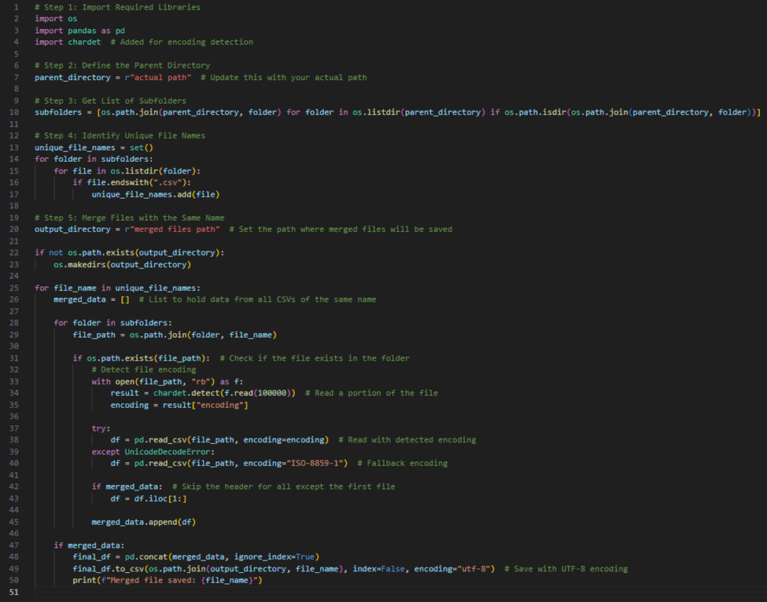
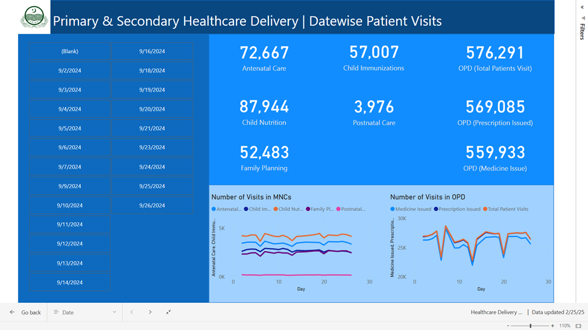
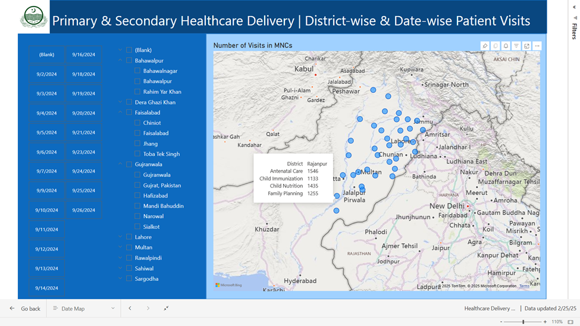

# Data Compilation, Transformation, and Visualization Report

## Table of Contents
- [Data Compilation, Transformation, and Visualization Report](#data-compilation-transformation-and-visualization-report)
  - [Table of Contents](#table-of-contents)
  - [1. Introduction](#1-introduction)
  - [2. Step 1: Data Compilation](#2-step-1-data-compilation)
    - [2.1 Data Overview](#21-data-overview)
    - [2.2 Tools and Technologies Used](#22-tools-and-technologies-used)
    - [2.3 Data Compilation Process](#23-data-compilation-process)
  - 
  - [3. Step 2: Data Transformation and Modeling](#3-step-2-data-transformation-and-modeling)
    - [3.1 Data Import into Power BI](#31-data-import-into-power-bi)
    - [3.2 Data Cleaning and Transformation](#32-data-cleaning-and-transformation)
    - [3.3 Creating Reference Tables](#33-creating-reference-tables)
    - [3.4 Establishing Relationships Between Tables](#34-establishing-relationships-between-tables)
  - [4. Step 3: Dashboard Creation](#4-step-3-dashboard-creation)
    - [4.1 Dashboard 1: Patient Visits by Date](#41-dashboard-1-patient-visits-by-date)
    - [4.2 Dashboard 2: Patient Visits by District and Division](#42-dashboard-2-patient-visits-by-district-and-division)
    - [4.3 Dashboard 3: Geographical Representation of Patient Data](#43-dashboard-3-geographical-representation-of-patient-data)
  - [5. Conclusion](#5-conclusion)

---

## 1. Introduction
This report outlines the process of compiling, transforming, and visualizing data from multiple CSV files into a structured and insightful format. The project involved handling large datasets, cleaning and transforming the data, and creating interactive dashboards for analysis. The steps are detailed below, along with the tools and methodologies used.

---

## 2. Step 1: Data Compilation

### 2.1 Data Overview
The project began with a dataset comprising 21 folders, each containing 9 CSV files. In total, there were 189 files, with some files containing over 500,000 rows and 25 columns. The primary task was to consolidate the 21 date-wise files of the same name into a single file, resulting in 9 compiled files.

### 2.2 Tools and Technologies Used
- **IDE**: Visual Studio
- **Programming Language**: Python
- **Python Libraries**: `OS`, `PANDAS`, and `CHARDET`

### 2.3 Data Compilation Process
The following steps were taken to compile the data:
1. **File Aggregation**: Using Python, the `OS` module was employed to navigate through the 21 folders and identify files with the same name.
2. **Data Reading and Merging**: The `PANDAS` library was used to read and concatenate the data from the 189 files into 9 consolidated files.
3. **Encoding Detection**: The `CHARDET` module was utilized to detect and handle any encoding issues in the CSV files.

This process ensured that the data from all 189 files was efficiently merged into 9 files, ready for further processing.

---

## 3. Step 2: Data Transformation and Modeling

### 3.1 Data Import into Power BI
The compiled data was imported into Power BI for further transformation and modeling. This step involved using Power Query Editor (PQE) to clean and prepare the data for analysis.

### 3.2 Data Cleaning and Transformation
The following tasks were performed in Power BI:
- **Header Promotion**: The first row of each dataset was promoted to headers.
- **Data Type Conversion**: Columns were converted to appropriate data types (e.g., dates, text, numbers).
- **Error Removal**: Rows with errors or inconsistencies were identified and removed.
- **Custom Columns**: Additional columns were created to enhance data analysis capabilities.

### 3.3 Creating Reference Tables
Two primary reference tables were created:
1. **Patient Information Table**: Contains patient details with a primary key of `MR No`.
2. **Facility Information Table**: Contains healthcare facility details with a primary key of `Facility Code`.

Duplicate values were removed from these tables to ensure data integrity.

### 3.4 Establishing Relationships Between Tables
Relationships were established between the tables to create a cohesive data model:
- **Patient Information Table**: Linked to other tables using the `MR No` primary key. The relationship cardinality was set to 1-to-many, with a unidirectional relationship.
- **Facility Information Table**: Linked to other tables using the `Facility Code` primary key. The relationship cardinality was also 1-to-many, with a unidirectional relationship.
- **Dates Table**: Linked to other tables to provide a timeline for the data.

To avoid causality issues, the `Dates Table`, `Facility Information Table`, and `Patient Information Table` were not directly linked to each other.

---

## 4. Step 3: Dashboard Creation

### 4.1 Dashboard 1: Patient Visits by Date
- **Purpose**: Visualize patient visits across all facilities over time.
- **Components**:
  - 8 Cards: Display key metrics such as total visits, unique patients, etc.
  - 2 Line Charts: Show trends in patient visits over time.
  - 1 Slicer: Allows filtering by date.
  - 

### 4.2 Dashboard 2: Patient Visits by District and Division
- **Purpose**: Analyze patient visits based on geographical divisions and districts.
- **Components**:
  - 8 Cards: Display metrics such as visits by district, division, etc.
  - 1 Line Charts: Show trends in patient visits by district and division.
  - 1 map: Displays patient locations.
  - 1 Slicer: Allows filtering by division and district.
  - 

### 4.3 Dashboard 3: Geographical Representation of Patient Data
- **Purpose**: Provide a geographical view of patient data.
- **Components**:
  - 1 Map: Displays patient locations.
  - 2 Slicers: Allow filtering by date and division/district.
- **Data Correction**: Initially, some locations were incorrectly mapped to cities in other countries. These values were replaced with precise geographical data to ensure accuracy.
- 

---

## 5. Conclusion
This project involved compiling large datasets, cleaning and transforming the data, and creating interactive dashboards for analysis. By leveraging Python for data compilation and Power BI for transformation and visualization, the data was successfully structured into a meaningful format. The dashboards provide valuable insights into patient visits, enabling data-driven decision-making.

---
